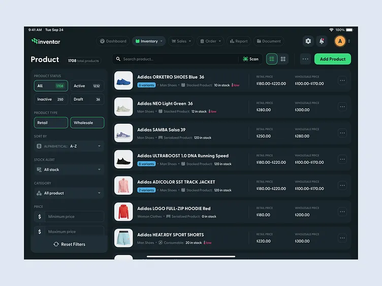

# inventar · Kit Room

A premium, **offline-first inventory manager for football-kit vendors**. Tag a
shirt with a short handwritten code, then scan or type that code to sell it —
stock drops by one, instantly, even with no internet.

Built as a polished, pixel-considered web app in the dark-emerald visual language
of the *Inventar* reference designs, themed end-to-end around football jerseys.



---

## The core idea

> The vendor writes a short auto-generated ID (like `AR-L-01`) on a paper tag and
> sticks it on the shirt. When it sells, they open the app, scan or type that ID,
> and inventory subtracts by one. No internet. No barcode hardware. Just a phone
> and a handwritten tag.

Every size variant gets its own tag using this exact logic:

```
first 2 letters of the name  +  first letter of the size  +  running number
        "Arsenal"            +          "Large"           +       01        =  AR-L-01
        "Arsenal"            +          "Small"           +       02        =  AR-S-02
        "Brazil"             +          "Medium"          +       03        =  BR-M-03
```

- UPPERCASE, **max 8 characters**, writable in under 3 seconds
- The running counter guarantees no two tags ever collide
- Implemented in [`src/lib/id.ts`](src/lib/id.ts)

---

## Screens

| Screen | What it does |
| --- | --- |
| **Homepage** (`/`) | An animated brand landing page — hero, team marquee, "how it works", a feature bento, a **live in-page demo of the real app**, pricing, and footer. |
| **Sign in / Sign up** (`/login`, `/signup`) | A split-screen auth page with a brand showcase, social buttons, email/password with validation, and a one-click **Continue as guest**. Session persists in `localStorage`; the app is gated behind it. |
| **Dashboard** (`/dashboard`) | Units in stock, sold today, revenue, low-stock alerts, a 7-day sales trend, top sellers, and the big amber **Scan to sell** action. |
| **Inventory** | Filterable product list (status, channel, stock alert, category, price) with team-coloured jersey art. Expand any row to copy its scan tags and adjust stock. List + grid views. |
| **Add product** | A 4-step wizard (General → Pricing → Stock → Tags) with a live **kit designer** (pattern + colours + squad number) and an auto-generated scan-tag reveal. |
| **Scan to sell** | Live camera viewfinder with a scanning overlay, reliable manual-entry fallback, "simulate a scan", confirmation card, green success flash, and an undoable session log. |
| **Sales history** | Every sale, grouped by day, filterable by Today / This week / All time, with running revenue. |
| **Reports** | Inventory valuation (stock value, cost, potential profit), sell-through, revenue trend, kit-mix donut, revenue by category, and top sellers. |

---

## Highlights

- **Custom SVG jerseys** — each kit is drawn in team colours with solid / stripes /
  hoops / sash / halves patterns and an optional squad number. No image assets,
  fully offline. See [`src/components/Jersey.tsx`](src/components/Jersey.tsx).
- **Real persistence** — products and sales are saved to `localStorage`, so your
  changes survive a refresh. Reset anytime from the avatar menu.
- **Motion everywhere** — count-up stats, staggered cards, an interactive area
  chart with hover tooltips, animated stepper and toasts.
- **Camera + graceful fallback** — uses the device camera where available; if it's
  blocked or absent, the manual path keeps everything working.

---

## Run it

```bash
npm install
npm run dev      # http://localhost:5180
```

- `/` — the marketing **homepage**
- `/login` · `/signup` — authentication (or hit **Continue as guest**)
- `/dashboard` — the app (Inventory, Scan, Sales, Reports all branch from here; gated by auth)

Build for production:

```bash
npm run build
npm run preview
```

---

## Tech

- **React 18** + **TypeScript** + **Vite**
- **Tailwind CSS v4** (CSS-first tokens in [`src/index.css`](src/index.css))
- **Framer Motion** for animation
- **lucide-react** for icons
- Hand-rolled SVG charts (no charting dependency)

## Project layout

```
src/
  components/   Jersey art, charts, nav/layout, UI primitives, toasts
    landing/    marketing nav + footer for the homepage
  pages/        Landing, Auth, Dashboard, Inventory, AddProduct, Scan, History, Reports
  store/        React-context store (+ persistence), auth context, selectors
  lib/          types, ID generator, formatting, class helper
  data/         football-jersey seed catalogue + seeded sales
reference/      the original Inventar mockups used as the design north-star
```

> Demo data is seeded on first load (Premier League heavy, plus European giants
> and two national sides) with realistic low-stock and out-of-stock stories.
